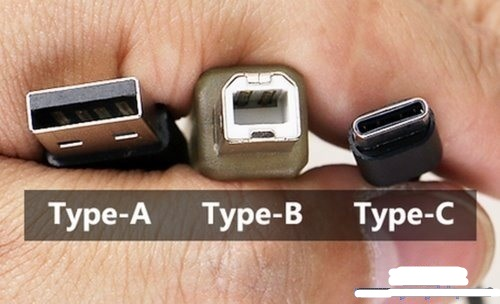
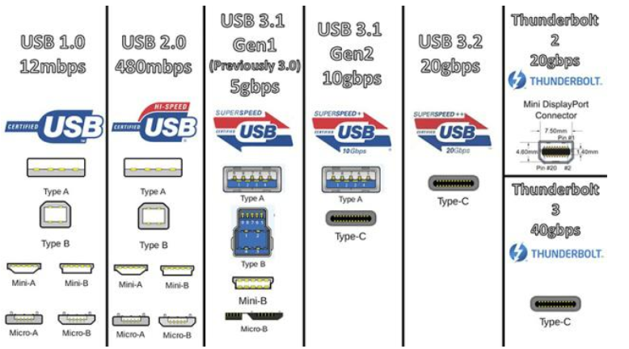
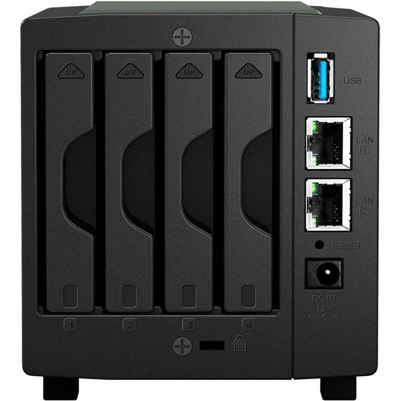

## USB接口与协议

type-a 和typ-c是物理接口类型， USB3.0和雷电是数据传输协议

​                                                                   接口类型

​																	 传输协议

传输速率gbps中的b代表bit，换算过后10gbps大约为1.2G/s

命名规则：3.1 gen1其实就是3.0的马甲

​		同理，3.2 gen1其实就是3.1 gen1

​			　3.2 gen2其实就是3.1 gen2

​			　3.2 gen2x2(这nt一般的命名) 速度能达到20gbps，只有type-c接口支持

## NAS

​		NAS（Network Attached Storage：网络附属存储）按字面简单说就是连接在网络上，具备资料存储功能的装置，因此也称为网络存储器。它是一种专用数据存储服务器。它以数据为中心，将存储设备与服务器彻底分离，集中管理数据，从而释放带宽、提高性能、降低总拥有成本、保护投资。其成本远远低于使用服务器存储，而效率却远远高于后者。

​		NAS将存储设备连接到现有的网络上来提供数据和文件服务。NAS服务器一般由存硬件、操作系统以及其上的文件系统等几个部分组成。NAS通过网络直接连接磁盘储存阵列，磁阵列具备了高容量、高效能、高可靠等特征。NAS将存储设备通过标准的网络拓扑结构连可以无需服务器直接上网，不依赖通用的操作系统，而是采用一个面向用户设计的，专门用于数据存储的简化操作系统，内置与网络连接所需的协议，从而使整个系统的管理和设置较为简单

