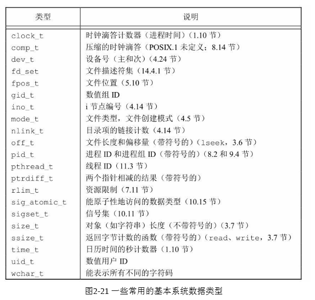

# 正则表达式

- 正则表达式(regular expression)，可简写为regex或RE，是用来简洁表达一组字符串的表达式

- [正则表达式语法规则](<https://www.jianshu.com/p/e25c4cfc8f4e>)

- 正则表达式的编译：将符合正则表达式语法的字符串转换成正则表达式特征

  ​	

# 基本系统数据类型

​	历史上，某些UNIX变量已与某些C数据类型联系在一起，例如，历史上主、次设备号存放在一个1 6位的短整型中， 8位表示主设备号，另外8位表示次设备号。但是，很多较大的系统需要用多于256个值来表示其设备号，于是，就需要有一种不同的技术。

​	头文件<sys/types.h >中定义了某些与实现有关的数据类型，它们被称之为基本系统数据类型（primitive system data type）。有很多这种数据类型定义在其他头文件中。在头文件中这些数据类型都是用C的typedef设施来定义的。它们绝大多数都以_t 结尾。用这种方式定义了这些数据类型后，在编译时就不再需要考虑随系统不同而变的实施细节

​	用这种方式定义了这些数据类型后, 在编译时就不再需要考虑随系统不同而变的实施细节。

# 句柄和文件描述符

- 句柄
  1. **句柄**是Windows下的概念。句柄是Windows下各种对象的标识符，比如文件（也许叫文档比较合适一点）、资源、菜单、光标、位图等。文件句柄和文件描述符类似，它也是一个非负整数，也用于定位文件数据在内存中的位置。
  2. 由于linux下所有东西都被看成是文件，比如文件（也许叫文档比较合适一点）、目录、进程、网络socket、各种硬件设备等，所以linux下的**文件描述符**其实就相当于windows下的句柄。文件句柄只是windows众多句柄中的一种类型而已。
  3. 可以这么说：句柄是指向指针的指针。句柄指向的空间稳定，这个稳定的空间存放着不稳定的地址，Windows内存管理器经常在内存中来回移动对象，这些对象的地址经常变化，但把这些变化的地址存放到不变的句柄地址空间里，就可以通过句柄确定这些对象了。

- 文件描述符

  对于linux而言，所有对设备和文件的操作都使用文件描述符来进行的。文件描述符是一个非负的整数，它是一个索引值，指向内核中每个进程打开文件的记录表。当打开一个现存文件或创建一个新文件时，内核就向进程返回一个文件描述符；当需要读写文件时，也需要把文件描述符作为参数传递给相应的函数。

  通常，一个进程启动时，都会打开3个文件：**标准输入、标准输出和标准出错处理。这3个文件分别对应文件描述符为0、1和2**（宏STD_FILENO、STDOUT_FILENO和STDERR_FILENO）。

  **每一个文件描述符会与一个打开文件相对应，同时，不同的文件描述符也会指向同一个文件**。**相同的文件可以被不同的进程打开也可以在同一个进程中被多次打开**。系统为每一个进程维护了一个文件描述符表，该表的值都是从0开始的，所以在不同的进程中你会看到相同的文件描述符，这种情况下相同文件描述符有可能指向同一个文件，也有可能指向不同的文件。具体情况要具体分析，要理解具体其概况如何，需要查看由内核维护的3个数据结构。

- 两者区别
  1. 文件句柄也称为文件指针(FILE *)：C语言中使用文件指针做为I/O的句柄。文件指针指向进程用户区中的一个被称为FILE结构的数据结构。FILE结构包括一个缓冲区和一个文件描述符。从某种意义上说文件指针就是句柄的句柄（在Windows系统上，文件描述符被称作文件句柄）。
  2. 文件描述符本质是一个索引号（非负整数），系统用户层可以根据它找到系统内核层的文件数据，即文件描述符是文件描述符表的一个索引。这是一个POSIX标准下的概念，常见于类Unix系统，比如linux。windows也是声称遵循POSIX标准的，所以windows也有文件描述符这个概念，但不常用。

# RPC

RPC(Remote Procedure Call)：远程过程调用，就是要像调用本地函数一样去调远程函数

- 本地调用

  > 1 int Multiply(int l, int r) {
  > 2    int y = l * r;
  > 3    return y;
  > 4 }
  > 5 
  > 6 int lvalue = 10;
  > 7 int rvalue = 20;
  > 8 int l_times_r = Multiply(lvalue, rvalue);

那么在第8行时，我们实际上执行了以下操作：

1. 将 lvalue 和 rvalue 的值压栈

2. 进入Multiply函数，取出栈中的值10 和 20，将其赋予 l 和 r

3. 执行第2行代码，计算 l * r ，并将结果存在 y

4. 将 y 的值压栈，然后从Multiply返回

5. 第8行，从栈中取出返回值 200 ，并赋值给 l_times_r

   ​	

- 远程调用的问题

  **Call ID映射**。我们怎么告诉远程机器我们要调用Multiply，而不是Add或者FooBar呢？在本地调用中，函数体是直接通过函数指针来指定的，我们调用Multiply，编译器就自动帮我们调用它相应的函数指针。但是在远程调用中，函数指针是不行的，因为两个进程的地址空间是完全不一样的。所以，在RPC中，所有的函数都必须有自己的一个ID。这个ID在所有进程中都是唯一确定的。客户端在做远程过程调用时，必须附上这个ID。然后我们还需要在客户端和服务端分别维护一个 {函数 <--> Call ID} 的对应表。两者的表不一定需要完全相同，但相同的函数对应的Call ID必须相同。当客户端需要进行远程调用时，它就查一下这个表，找出相应的Call ID，然后把它传给服务端，服务端也通过查表，来确定客户端需要调用的函数，然后执行相应函数的代码。

  **序列化和反序列化**。客户端怎么把参数值传给远程的函数呢？在本地调用中，我们只需要把参数压到栈里，然后让函数自己去栈里读就行。但是在远程过程调用时，客户端跟服务端是不同的进程，不能通过内存来传递参数。甚至有时候客户端和服务端使用的都不是同一种语言（比如服务端用C++，客户端用Java或者Python）。这时候就需要客户端把参数先转成一个字节流，传给服务端后，再把字节流转成自己能读取的格式。这个过程叫序列化和反序列化。同理，从服务端返回的值也需要序列化反序列化的过程。

  **网络传输**。远程调用往往用在网络上，客户端和服务端是通过网络连接的。所有的数据都需要通过网络传输，因此就需要有一个网络传输层。网络传输层需要把Call ID和序列化后的参数字节流传给服务端，然后再把序列化后的调用结果传回客户端。只要能完成这两者的，都可以作为传输层使用。因此，它所使用的协议其实是不限的，能完成传输就行。尽管大部分RPC框架都使用TCP协议，但其实UDP也可以，而gRPC干脆就用了HTTP2。Java的Netty也属于这层的东西。

