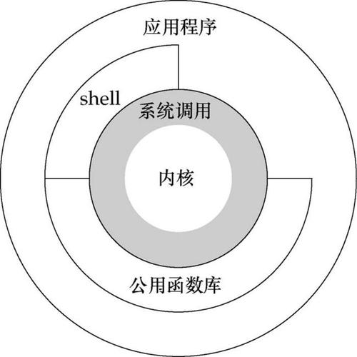
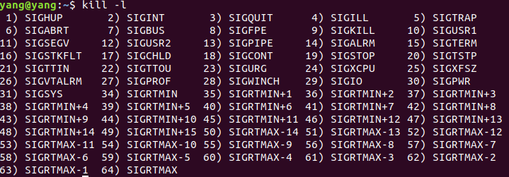
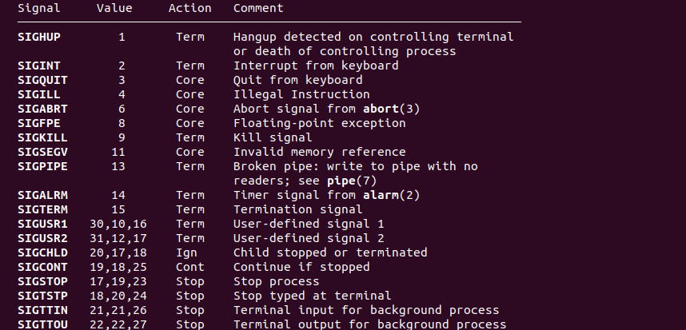

## 用户态和内核态

## 文件描述符

linux系统下一切皆文件(包括套接字等），内核（kernel）利用文件描述符（file descriptor）来访问文件。文件描述符是非负整数。打开现存文件或新建文件时，内核会返回一个文件描述符。读写文件也需要使用文件描述符来指定待读写的文件。

## 信号

- 信号的产生

  信号是发生在某时间时对进程的通知，有时称为软中断。它一般是异步的，也就是说，进程不可能提前知道信号发生的时间。

  如CTRL+C是一个信号，显示的kill 是一个信号。

  信号可以

  1. 由一进程发往另一进程（或本身）
  2. 由内核发往某进程

  例如SIGCHLD就是内核在某进程终止时发给此进程的父进程的信号。

- 处理信号

  1. 提供一个函数，在信号发生时调用。这个函数称为信号处理程序（signal handler），此行为称为捕获信号。但有两个信号不能捕获，SIGKILL和SIGSTOP。

  2. 设置信号的处理办法为SIG_IGN来忽略它，但SIGKILL和SIGSTOP不能忽略。

  3. 设置信号的处理方法是SIG_DFL来设置缺省处理方法。一般来说，缺省处理的办法是在接受到信号终止进程，特定信号还在当前的工作目录产生一个进程的核心映像。个别信号的缺省处理是忽略。

     ​	

- linux系统信号

  Linux系统中执行kill -l 命令可以显示有哪些信号

  

  ​	

  信号的帮助信息可以使用man 7 signal显示

  
  
  ​				

​			

## unistd.h头文件

unistd.h是unix std的意思，是POSIX标准定义的unix类系统定义符号常量的头文件，包含了许多UNIX系统服务的函数原型，例如read函数、write函数和getpid函数。 **unistd.h在unix中类似于window中的windows.h**。

是操作系统为用户提供的统一API接口，方便调用系统提供的一些服务。

​					

## 系统修复 

- Recovery Mode 

  Ubuntu操作系统带有恢复模式，通过此功能，用户可以访问损坏系统的命令行，修复错误配置的文件，测试系统内存是否不工作等等。ubuntu进入恢复模式的方法是开机后移动到Adavanced options，选择recovery mode内核 。

  Recovery Mode参数：

  - Clean：快速释放系统分区上的空间。
  - Dpkg：修复和卸载导致系统出现问题的任何可能损坏的软件包。
  - Fsck：扫描损坏的硬盘并删除它们来快速修复损坏的硬盘
  - Grub：重新设置Grub系统来扫描你的系统并自动更新引导加载程序。
  - Root：获得Root访问权限(以root身份登录)

- you are in emergency mode 

  出现这种情况一般是硬盘挂载出错，解决方法：

  1. 先查看日志`journalctl -xb` ,使用查找命令查看是哪个磁盘出错`/ fsck failed`，使用n可以往下查找下一个相关字段并记住编号。找到后输入`:q`回车退出日志
  
  2. 输入`vim /etc/fstab`，注释除了/、/boot、swap、/home之外的磁盘保存退出(另一种方法是将损坏分区后面的数字从2改为0，代表启动时不检查该分区，治标不治本)
  
  3. 找到uuid编号一样的那个sda盘并卸载，用fsck -y /xx/xx命令修复磁盘，有可能损坏数据，最好事先备份
  
  4. 重启
  
     ​	
  
- 修改sudoers文件权限导致不能使用sudo

  sudoers文件默认权限为0440，如果修改成777将导致不能使用sudo。

  - 方法一：用su命令登录root账户修改权限
  - 方法二：在Recovery Mode下选择root登录，再修改文件权限	  