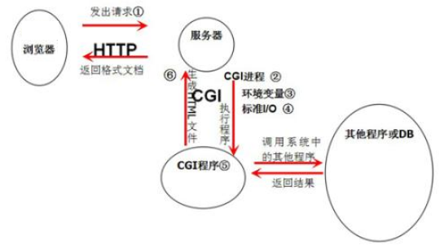

## CGI

公共网关接口（Common Gateway Interface，*CGI*）是Web 服务器运行时外部程序的规范，按*CGI* 编写的程序可以扩展服务器功能。

CGI是Web服务器和一个独立的进程之间的协议，它会把HTTP请求`Request`的`Header`头设置成进程的环境变量，HTTP请求的`Body`正文设置成进程的标准输入，进程的标准输出设置为HTTP响应`Response`，包含`Header`头和`Body`正文。

