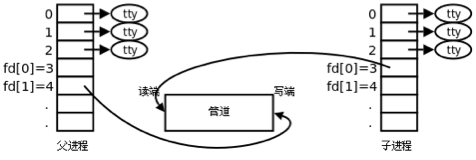
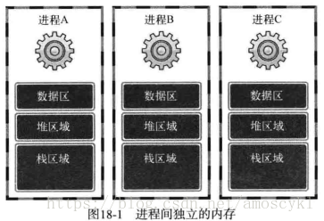
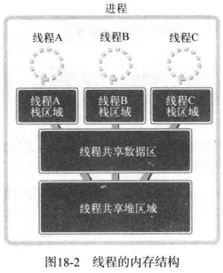
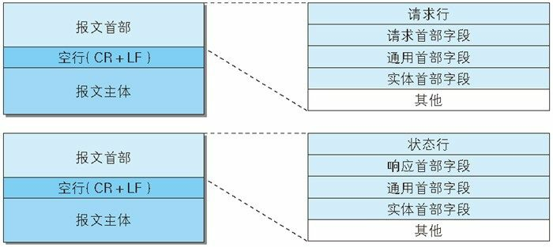
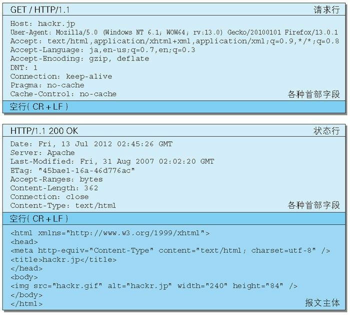

# 套接字编程

## 套接字Socket

套接字是一种通信机制，凭借这种机制，客户/服务器系统的开发工作既可以在本地单机上进行，也可以跨网络进行，Linux所提供的功能（如打印服务，ftp等）通常都是通过套接字来进行通信的。

## 套接字编程

网络编程创建连接请求的套接字过程：

1. 调用socket函数创建套接字

   > #include <sys/socket.h>
   >
   > int socket(int domain, int type, int protocol);
   >
   > domain-协议族               一般为PF_INET，代表IPv4互联网协议族
   >
   >  type-数据传输方式        SOCK_STREAM代表面向连接的套接字，对应TCP   
   >
   > ​					 SOCK_DGRAM代表面向消息的套接字，对应UDP
   >
   >  protocol-通信协议		一般设为0，表示选择当前family和type组合下的protocol
   >
   >  
   >
   > 成功返回文件描述符，失败时返回1

2. 调用bind函数分配IP地址和端口号

   > int bind(int sockfd,  sockaddr* myaddr, socklen_t addrlen);
   >
   > sockfd-套接字文件描述符
   >
   > myaddr-指向特定协议的地址结构的指针
   >
   > addrlen-该地址结构的长度
   >
   > 
   >
   > 成功返回0，失败返回-1

3. 调用listen函数转为可接收请求状态

   > int listen(int sockfd, int backlog);
   >
   > sockfd-套接字文件描述符
   >
   > backlog-连接请求等待队列的长度
   >
   >  
   >
   > 成功时返回0，失败时返回-1

 

4. 调用accept函数受理连接请求

   >  int accept(int sockfd,  sockaddr* addr,  socklent_t* addrlen);
   >
   > sockfd-套接字文件描述符
   >
   > addr-指向客户端地址结构体的指针
   >
   > addrlen-addr结构体的长度
   >
   >  
   >
   > 成功返回**创建的套接字文件描述符**，失败时返回-1

   

   

客户端创建套接字后调用connect函数

> int connect(int fd, sockaddr* serv_addr, socklen_t addrlen)

## 参数说明

- SOCK_STREAM：面向连接的套接字(TCP)

  - 传输过程数据不会丢失
  - 按序传输数据
  - 传输的数据**不存在数据边界**

  　收发的套接字内部有缓存，简言之就是字节数组。通过套接字传输的数据将保存到该数组，收到数据不意味着马上调用read函数。只要不超过数组容量，有可能在数据填充后一次read调用全部，也可能分多次进行调用，即传输的数据不存在数据边界

  　　

- sockaddr_in结构体成员变量

  - sin_family    地址族
  - sin_port        TCP/UDP端口号
  - sin_addr        IP地址
  - sin_zero         不使用

  　实际bind函数第二个参数期望得到的是sockaddr结构体变量地址值，但对于包含地址信息来讲非常麻烦，所以有了sockaddr_in结构体，生成符合bind函数要求的字节流，最后转换成sockaddr型的结构体传递给bind函数

  　　

- 字节序：CPU向内存保存数据的方式有２种，意味着CPU解析数据的方式也分为２种

  - 大端序(Big Endian)：高位字节存放到低位地址
  - 小端序(Little Endian)：高位字节放到高位地址

  代表CPU数据保存方式的主机字节序(Host Byte Order)在不同CPU中各不相同，目前主流的Intel系列CPU以小端序保存数据。因此在网络传输数据时约定统一方式，这种约定称为网络字节序(Network Byte Order)－统一为大端序

  htons函数中h代表主机(host)字节序，n代表网络(network)字节序，s指的是short.即可以解释为"将short型数据从主机字节序转化为网络字节序"

  通常以s作为后缀的函数中，s代表２个字节short，因此常用于端口号转换；以l结尾的函数中，l代表4个字节long，因此用于IP地址转换

  ​     

- 网络地址初始化

  memset(&addr, 0, sizeof(addr));                        //结构体变量addr的所有成员初始化为0

  addr.sin_family = AF_INET;                                  //指定地址族

  

  addr.sin_addr.s_addr = inet_addr(serv_ip);       //基于字符串的IP地址初始化(硬编码)

  addr.sin_addr.s_addr = htonl(INADDR_ANY);     //基于字符串的IP地址初始化(软编码)

  

  addr.sin_port = htons(atoi(serv_port));               //基于字符串的端口号初始化

  利用常数INADDR_ANY可以自动获取运行服务器端的计算机IP地址。

  127.0.0.1是回送地址(loopback address)，指的是计算机自身IP地址

## 基于linux的文件操作

- 打开文件

  > #include <sys/types.h>
  >
  > #include  <sys/stat.h>
  >
  > #include  <fcntl.h>
  >
  > ​	 
  >
  > int  open(const  char* path,  int  flag);
  >
  > - path     文件名的字符串地址
  > - flag       文件打开模式信息

  成功时返回文件描述符，失败时返回-1

  ​			

- 关闭文件

  > #include  <unistd.h>
  >
  > ​	
  >
  > int  close(int  fd);
  >
  > - fd        需要关闭的文件或套接字的文件描述符

  成功时返回０，失败时返回-1

  ​		

- 将数据写入文件

  > $include  <unistd.h>
  >
  > ​	
  >
  > ssize_t  write(int fd, const  void* buf,  size_t  nbytes);
  >
  > - fd            显示数据传输对象的文件描述符
  > - buf         保存要传输数据的缓冲地址值
  > - nbytes    要传输数据的字节数

  成功时返回写入的字节数，失败时返回-1

  ​			

- 读取文件中的数据

  > #include <unistd.h>
  >
  > ​	
  >
  > ssize_t  read(int  fd,   void* buf,  size_t  nbytes);
  >
  > - fd          显示数据接收对象的文件描述符
  > - buf        要保存接收数据的缓冲地址值
  > - nbytes   要接受数据的最大字节数

  成功时返回接收的字节数(但遇到文件尾则返回0)，失败时返回-1

  

## 缓冲区以及阻塞模式

1. 缓冲区概念

		每个socket被创建后，都会分配两个缓冲区，输入缓冲区和输出缓冲区。(全双工)

		**write()/send() 并不立即向网络中传输数据，而是先将数据写入缓冲区中，再由TCP协议将数据从缓冲区发送到目标机器**。一旦将数据写入到缓冲区，函数就可以成功返回，不管它们有没有到达目标机器，也不管它们何时被发送到网络，这些都是TCP协议负责的事情。
		
		**read()/recv() 函数也是如此，也从输入缓冲区中读取数据，而不是直接从网络中读取**。

- I/O缓冲区在每个TCP套接字中单独存在；
- I/O缓冲区在创建套接字时自动生成；
- 即使关闭套接字也会继续传送输出缓冲区中遗留的数据；
- 关闭套接字将丢失输入缓冲区中的数据。

​        

不会发生超过输入缓冲大小的数据传输，因为TCP会控制数据流

2. 使用write()/send()发送数据

   阻塞模式下：

   - 首先会检查缓冲区，**如果缓冲区的可用空间长度小于要发送的数据，那么 write()/send() 会被阻塞（暂停执行）**，直到缓冲区中的数据被发送到目标机器，腾出足够的空间，才唤醒 write()/send() 函数继续写入数据；
   - 如果TCP协议正在向网络发送数据，那么输出缓冲区会被锁定，不允许写入，write()/send() 也会被阻塞，直到数据发送完毕缓冲区解锁，write()/send() 才会被唤醒；
   - 如果要写入的数据大于缓冲区的最大长度，那么将分批写入，直到所有数据被写入缓冲区 write()/send() 才能返回；
   - send()函数默认情况下会使用Nagle算法。**Nagle算法通过将未确认的数据存入缓冲区直到积攒到一定数量一起发送的方法，来降低主机发送零碎小数据包的数目**。所以假设send()函数发送数据过快的话，该算法会将一些数据打包后统一发出去。通过setsockopt()的**TCP_NODELAY**选项来禁用Nagle算法。

   非阻塞模式下：

   - send()函数的过程仅仅是将数据拷贝到协议栈的缓冲区而已，如果缓冲区可用空间不够，则尽可能拷贝，返回成功拷贝的大小；如果缓存区可用空间为0，则返回-1，同时设置errno为EAGAIN。

   ​               

3. 使用read()/recv()读取数据

   阻塞模式下：

   - 首先会检查缓冲区，**如果缓冲区中有数据，那么就读取，否则函数会被阻塞，直到网络上有数据到来**；
   - 如果要读取的数据长度小于缓冲区中的数据长度，那么就**不能一次性将缓冲区中的所有数据读出，剩余数据将不断积压**，直到读取到数据后 read()/recv() 函数才会返回，否则就一直被阻塞。

   非阻塞模式下：

   - 接收数据时perror时常遇到**“Resource temporarilyunavailable”**的提示，errno代码为11(EAGAIN)。这表明你**在非阻塞模式下调用了阻塞操作**，在该操作没有完成就返回这个错误，这个错误不会破坏socket的同步，继续循环接着recv就可以。

​    

​     	 

## TCP套接字发送数据过程

1. 数据首先由应用程序缓冲区复制到发送端的输出缓冲区（位于内核），这个过程是用类似write功能的函数完成的。**有的人通常看到write成功就以为数据发送到了对端主机，其实这是错误的，write成功仅仅表示数据成功的由应用进程缓冲区复制到了输出缓冲区**。
2. **然后内核协议栈将输出缓冲区中的数据发送到对端主机，注意这个过程不受应用程序控制，而是发送端内核协议栈完成，其中包括使用滑动窗口、拥塞控制等功能**。
3. 数据到达接收端主机的输入缓冲区，注意这个接收过程也不受应用程序控制，而是**由接收端内核协议栈完成，其中包括发送ack确认等**。
4. **数据由套接字接收缓冲区复制到接收端应用程序缓冲区，这个过程是由类似read等函数来完成**。

## TCP套接字建立连接

三次握手：

- 第一次：客户端发送请求到服务器，服务器知道客户端发送，自己接收正常。SYN=1,seq=x
- 第二次：服务器发给客户端，客户端知道自己发送、接收正常，服务器接收、发送正常。ACK=1,ack=x+1,SYN=1,seq=y
- 第三次：客户端发给服务器：服务器知道客户端发送，接收正常，自己接收，发送也正常.seq=x+1,ACK=1,ack=y+1

## TCP套接字断开链接

四次挥手：

- 第一次：客户端请求断开FIN,seq=u
- 第二次：服务器确认客户端的断开请求ACK,ack=u+1,seq=v
- 第三次：服务器请求断开FIN,seq=w,ACK,ack=u+1
- 第四次：客户端确认服务器的断开ACK,ack=w+1,seq=u+1

## 优雅的断开连接

​		上图演示了两台正在进行双向通信的主机。主机A发送完数据后，单方面调用 close()/closesocket() 断开连接，之后主机A、B都不能再接受对方传输的数据。实际上，是完全无法调用与数据收发有关的函数，由主机B传输的，主机A接收的数据也就销毁了。这种生硬的方式显然不够“优雅”

​		为了解决这类问题，半关闭(Half-close)的方法应运而生。半关闭是指，可以传输数据但无法接收，或者可以接收数据但无法传输，即关闭流的一半。

​		实现方法是使用shutdown函数

> #include<sys/socket.h>
>
> int shutdown(int sock,  int howto);
>
> ​    
>
> 成功时返回0，失败返回-1
>
> - sock :需要断开的套接字文件描述符
> - howto：断开连接的方式  

​       

howto 在 Linux 下有以下取值：

- SHUT_RD：断开输入流。套接字无法接收数据（即使输入缓冲区收到数据也被抹去），无法调用输入相关函数。
- SHUT_WR：断开输出流。套接字无法发送数据，但如果输出缓冲区中还有未传输的数据，则将传递到目标主机。
- SHUT_RDWR：同时断开 I/O 流。相当于分两次调用 shutdown()，其中一次以 SHUT_RD 为参数，另一次以 SHUT_WR 为参数。

## time-wait状态

​		套接字经过4次挥手后并非立即消除，而是要经过一段时间Time-wait状态，只有先断开连接的（先发送FIN消息的）主机才经过Time-wait状态。此时，若服务器先断开连接，则无法立即重新运行，套接字处在Time-wait状态过程时，相应端口是正在使用的状态。而客户端套接字的端口是任意指定的，每次运行程序都会动态分配端口号，因此无需过多关注Time-wait状态。

- Time-wait存在理由：假设主机1向主机2发送最后的ack消息后立即消除套接字，但最后这条信息在传输过程中丢失，则主机2会认为自己之前发送的FIN消息未能到达主机1，继而试图重传。但此时主机1已经是关闭的状态，因此主机2永远无法收到主机1的消息。相反，若主机1的套接字处在Time-wait状态，则会向主机2重传最后的ACK消息。

## Nagle算法

​		TCP/IP协议中,无论发送多少数据,总是要在数据前面加上协议头,同时,对方接收到数据,也需要发送ACK表示确认.为了尽可能的利用网络带宽,TCP总是希望尽可能的发送足够大的数据.(在一个连接中会设置MSS参数,因此,TCP/IP希望每次都能够以MSS尺寸的数据块来发送数据).Nagle算法就是为了尽可能发送大块数据,避免网络中充斥着许多小数据块.

> 只有收到前一数据的ACK消息时，Nager算法才发送下一数据

TCP套接字默认使用Nager算法交换数据，因此最大限度进行缓冲，直到收到ACK,一般情况下，不使用Nagle算法可以提高传输速度，但如果无条件放弃使用，就会增多过多的网络流量

​		

# 多进程服务器

## 并发服务器端的实现方法

网络程序中数据通信时间比CPU运算时间占比更大，因此向多个客户端提供服务是一种有效利用CPU的方式。下面是几种具有代表性的实现模型和方法：

- 多进程服务器：通过创建多个进程提供服务(Ｗindows不支持)
- 多路复用服务器：通过捆绑并统一管理I/O对象提供服务
- 多线程服务器：通过生成与客户端等量的线程提供服务

## 进程

- 进程(process)：占用内存空间的正在运行的程序

  ​		

- 进程ID：无论进程是如何创建的，所有进程都会从操作系统分配到ID（即PID)。其值为大于２的整数，１要分配给操作系统启动后的首个进程，因此用户无法得到ID值１

  > 通过指令ps可以查看当前运行的所有进程

  ​		

- CPU核的个数与进程数：拥有两个核的CPU称为双核(Dual)CPU，拥有４个核的CPU称为４核(Quad)CPU。**一个CPU中可能包含多个运算设备(核)，核的个数与可同时运行的进程数相同。相反，若进程数超过核数，进程将分时使用CPU资源（上下文切换）**。因为CPU运转速度极快，感觉上像是所有进程同时运行。

  ​	

- 调用fork()函数创建进程

  fork()函数将创建用的进程副本，并非根据完全不同的程序创建进程，而是复制正在进行的、调用fork函数的进程,调用fork函数后，父子进程拥有完全独立的内存结构。另外，两个进程都将执行fork函数调用后的语句。但因为通过同一个进程、复制相同的内存空间，之后的程序流要根据fork函数的返回值加以区分

  > #include <unistd.h>
  >
  > pid_t  fork(viod);
  >
  > 成功时返回进程ID，失败返回-1
  >
  > - 父进程：返回子进程ID
  > - 子进程：返回０
  
  调用fork()函数后，父子进程的执行顺序不确定，哪个先运行看内核的调度算法。如果需要固定顺序，可以使用sleep或wait使当前进程后运行
  
     
  
  **sleep是休眠，也就是进程阻塞，从就绪队列取出本进程，插入阻塞队列。sleep时间到，进程变为就绪状态，插入就绪队列，等待调度程序调度**，也就是说，执行不执行看调度程序，阻塞一定不执行，就绪也不一定是马上执行的。

## 僵尸进程

僵尸进程是当子进程比父进程先结束，而父进程又没有回收子进程，释放子进程占用的资源，此时子进程将成为一个僵尸进程。如果父进程先退出 ，子进程被init接管，如果父进程结束了，那么init会回收子进程占用的相关资源。**但是如果父进程是一个循环，不会结束（例如守护进程)，那么子进程就会一直保持僵尸状态。**此时保留的信息就不会释放，比如**进程号就会被一直占用**，但系统所能使用的进程号时有限的，如果产生了大量的僵尸进程，将导致系统没有可用的进程号。

向exit函数传递的参数值和return语句返回的值都会传递给操作系统，而操作系统不会销毁子进程，直到把这些值传递给产生该子进程的父进程，也就是说将子进程变成僵尸进程的正是操作系统。

> 应该向创建子进程的父进程传递子进程的exit参数值或return语句的返回值

操作系统不会主动把这些值传递给父进程，只有父进程主动发起请求（函数调用）时，操作系统才会传递该值。

​		

- 销毁僵尸进程

  为了销毁僵尸进程，父进程应该主动请求获取子进程的返回值：

  - 调用wait函数

    > #include  <sys/wait.h>
    >
    > ​		
    >
    > pid_t  wait(int*  statloc);
    >
    > - statloc      子进程返回值保存内存空间

    成功时返回终止的子进程ID，失败时返回-1

    调用此函数时如果已有子进程终止，那么子进程终止时传递的返回值将保存到该函数的参数所指内存空间。但函数参数指向的单元中还包含其他信息，因此需要通过下列宏进行分离：

    - WIFEXITED 子进程正常终止时返回“真”(true)
    - WEXITSTATUS 返回子进程的返回值

    需要注意的是，调用wait函数时，如果没有已终止的子进程，那么程序将会阻塞直到有子进程终止。

    ​		

  - 调用waitpid函数

    > #include <sys/wait.h>
    >
    > ​		
    >
    > pid_t  waitpid(pid_t  pid,  int*  statloc,  int  options);
    >
    > - pid             等待终止的目标子进程ID，若传递-1，则与wait函数相同，可以等待任意子进程终止
    > - statloc       与wait函数的statloc参数相同
    > - options      传递头文件中声明的常亮WNOHANG，即使没有终止的子进程也不会进入阻塞状态，而是返回0并退出函数

    成功时返回终止的子进程ID(或0)，失败时返回-1

    

## 孤儿进程

一个父进程退出，而它的一个或多个子进程还在运行，那么那些子进程将成为孤儿进程。孤儿进程将被init进程(进程号为1)所收养，并由init进程对它们完成状态收集工作。		

每当出现一个孤儿进程的时候，内核就把孤儿进程的父进程设置为init，而init进程会循环地wait()它的已经退出的子进程。**因此孤儿进程并不会有什么危害。**

## 信号

信号（signal）是一种处理异步事件的方式，用于通知接受进程有某种事件发生，除了用于进程外，还可以发送信号给进程本身。为了响应该消息，执行与信息有关的自定义操作的过程称为“处理”或“信号处理”。请求操作系统调用特定函数，称此函数为**信号注册函数**，通过如下函数调用完成。

>#include   <signal.h>
>
>​		
>
>void  (*signal(int  signo,  void  (\*func)(int) ) ) (int);

为了在产生信号时调用，返回之前注册的函数指针

- 函数名：signal
- 参数：int signo,  void(*  func)(int)
- 返回类型：参数类型为int型，返回void型函数指针

调用上述函数时，第一个参数为特殊情况信息，第二个参数为特殊情况下将要调用的函数的地址值(指针值)。发生第一个参数代表的情况时，调用第二个参数所指的函数。第一个参数部分特殊情况如下：

- SIGALRM：已到通过调用alarm函数注册的时间
- SIGINT：输入CTRL+C
- SIGCHILD：子进程终止

以上就是信号注册过程，注册好信号后，发生注册信号时(注册的情况发生时)，操作系统将调用该信号对应的函数

​		

- alarm函数

  > #include  <unistd.h>
  >
  > ​	
  >
  > unsigned  int  alarm(unsigned   int  seconds);

  返回0或以秒为单位的距SIGALRM信号发生所剩时间

- sigaction函数

  类似于signal函数，完全可以代替后者，也更稳定

  > #include  <signal.h>
  > 	
  >
  > int  sigaction(int  signo,  const  struct  sigaction* act,  struct sigaction*  oldact);
  >
  > - signo      与signal函数相同，传递信号信息
  > - act           对应于第一个参数的信号处理函数(信号处理器)信息
  > - oldact      通过此函数获取之前注册的信号处理函数指针，若不需要则传递0

  调用前需声明并初始化sigaction结构体变量，该结构体定义如下：

  >struct  sigaction
  >
  >{
  >
  >​		void  (*sa_handler)(int);
  >
  >​		sigset_t   sa_mask;
  >
  >​		int  sa_flags;
  >
  >}

  ​			

## 管道

进程间通信(Inter Process Communication)意味着两个不同的进程间可以交换数据，为了完成这一点，操作系统应提供两个进程可以同时访问的内存空间

管道(PIPE)是一种最基本的IPC机制，管道并非属于进程的资源，而是和套接字一样，属于操作系统，由pipe函数创建

> #include  <unistd.h>
>
> ​	
>
> int  pipe(int  filedes[2])
>
> - filedes[0]     通过管道接收数据时使用的文件描述符，即管道出口
> - filedes[1]     通过管道传输数据时使用的文件描述符，即管道入口

成功时返回0，失败时返回-1

以两个元素的int数组作为参数调用上述函数时，数组中有两个文件描述符，他们将被用作管道的出口和入口。父进程调用该函数时将创建管道，同时获取对应于出入口的文件描述符，将入口或出口的文件描述符传递给子进程

通过一个管道可以进行双向通信，但最好的方式还是创建两个管道

# I/O多路复用

I/O多路复用(multiplexing)本质是通过一种机制（系统内核缓冲I/O数据），让单个线程可以监视多个文件描述符，一旦某个描述符就绪（一般是读或写就绪），能够通知程序进行相应的读写操作。

​					

**将用户socket对应的fd注册进select、poll、epoll，然后让这些函数监听哪些socket上有消息到达**，这样就避免了大量的无用操作，此时的socket应该采用非阻塞模式。这样，整个过程只在调用select、poll、epoll这些调用的时候才会阻塞，收发客户消息是不会阻塞的，整个进程或者线程就被充分利用起来，这就是**事件驱动**，所谓的reactor模式。

## select

select函数是一个轮循函数，循环询问文件节点，可设置超时时间，超时时间到了就跳过代码继续往下执行。

使用select函数时，可以将多个文件描述符集中到一起统一监视，项目如下

- 是否存在套接字接收数据
- 无需阻塞传输数据的套接字有哪些
- 哪些套接字发生了异常

上述监视项称为事件（event)，发生监视项对应情况时，称发生了“事件”

- select使用方法

  - 设置文件描述符：利用select函数可以同时监视多个文件描述符，可以视为监视套接字，此时需要将要监视的文件描述符集中到一起集中时也要按照监视项（接收、传输、异常）进行区分，即按照上述3种监视分为3类。使用fd_set数组变量执行此项操作，该数组是存有0和1的位数组。最左端的位表示文件描述符0（所在位置），如果该位设置为1，则表示该文件描述符是监视对象。通过操作4类宏来完成对fd_set的操作：

    - FD_ZERO(fd_set* fdset)：将fd_set变量的所有位初始化为0

    - FD_SET(int fd, fd_set* fdset)：在参数fdset指向的变量中注册文件描述符fd的信息

    - FD_CLR(int fd, fd_set* fdset)：从参数fdset只想的变量中清楚文件描述符fd的信息

    - FD_ISSET(int fd, fd_set* fdset)：若参数fdset指向的变量中包含文件描述符fd的信息则返回“真“

      ​				

      

  - 设置监视范围及超时

    > #include<sys/select.h>
    >
    > #include<sys/time.h>
    >
    > ​    
    >
    > int select(int maxfd,  fd_set\*readset,  fd_set\* writeset, fd_set* exceptset, const struct timeval* timeout)
    >
    > 成功返回大于0的值（发生事件的文件描述符数），失败时返回-1
    >
    > ​		
    >
    > - maxfd                     监视对象文件描述符的数量（将最大的文件描述符值加1,因为文件描述符从0开始)
    > - readset                   将所有关注“是否存在待读取数据”的文件描述符注册到fd_set变量，并传递起地址值
    > - writeset                  将所有关注“是否可传输无阻塞数据”的文件描述符注册到fd_set变量，并传递起地址值
    > - exceptset               将所有关注“是否发生异常”的文件描述符注册到fd_set变量，并传递起地址值
    > - timeout                  调用select函数后，为防止陷入无限阻塞的状态，传递超时信息

    本来select函数只有在监视的文件描述符发生变化时才返回，如果未发生变化，就会进入阻塞状态。指定超时时间就是为了防止这种情况的发生。

    ​							

  - 调用select函数后查看结果

    select函数调用完成后，像其传递的fd_set变量中将发生变化。原来为1的所有位均变为0，但发生变化的文件描述符除外。因此，可以认为值仍然

    为1的的位置上的文件描述符发生了变化。

- 为什么select慢：

  1. 在第一次所有监听都没有事件时，调用 select 都需要把进程挂到所有监听的文件描述符一次。

  2. 有事件到来时，不知道是哪些文件描述符有数据可以读写，需要把所有的文件描述符都轮询一遍才能知道。

  3. 通知事件到来给用户进程，需要把整个 bitmap 拷到用户空间，让用户空间去查询。

## poll

> int poll (struct pollfd *fds, unsigned int nfds, int timeout);
>
> ​		
>
> - `fds`：一个`pollfd`队列的队头指针，我们先把需要监视的文件描述符和他们上面的事件放到这个队列中
> - `nfds`：队列的长度
> - `timeout`：事件操作，设置指定正数的阻塞事件，0表示非阻塞模式，-1表示永久阻塞。

不同于select使用三个位图来表示三个fdset的方式，poll使用一个 pollfd的指针实现。

struct pollfd {
int fd; /* file descriptor */
short events; /* requested events to watch */
short revents; /* returned events witnessed */
};
pollfd结构包含了要监视的event和发生的event，不再使用select“参数-值”传递的方式。同时，**pollfd并没有最大数量限制**（基于链表）但是数量过大后性能也是会下降。 和select函数一样，poll返回后，需要轮询pollfd来获取就绪的描述符。 

## epoll

### 实现函数

- epoll_create：创建保存epoll文件描述符的空间

  >#include <sys/epoll.h>
  >
  >
  >
  >int  epoll_create(int size);

  成功时返回epoll文件描述符，失败时返回-1.

  调用epoll_create函数时创建的文件描述符保存空间称为“epoll例程”，size参数并非用来决定例程的大小，操作系统将完全忽略。

  ​				

- epll_ctl：向空间注册并注销文件描述符

  > #include  <sys/epoll.h>
  >
  > ​	
  >
  > int  epoll_ctl(int  epfd,  int  op,  int  fd,  struct  epoll_event *event);
  >
  > - epfd          用于注册监视对象的epoll例程的文件描述符
  > - op             用于指定监视对象的添加、删除或更改等操作
  > - fd              需要注册的监视对象的文件描述符
  > - event        监视对象的事件类型

  成功时返回0，失败返回-1

  第二个参数传递的常量及意义：
  
  - EPOLL_CTL_ADD：将文件描述符注册到epoll例程
  - EPOLL_CTL_DEL： 从epoll例程中删除文件描述符
  - EPOLL_CTL_MOD：更改注册的文件描述符的关注事件发生情况
  
  epoll通过结构体epoll_event将发生变化的文件描述符单独集中到一起：
  
  > struct  epoll_event
  >
  > {
  >
  > ​		__unit32_t  events;
  >
  > ​		epoll_data_t  data;
  >
  > }
  >
  > ​	
  >
  > typedef  union  epoll_data
  >
  > {
  >
  > ​		void*  ptr;
  >
  > ​		int       fd;
  >
  > ​		__uint32_t     u32;
  >
  > ​		__uint64_t     u64;
  >
  > }epoll_data_t;
  
  声明足够大的epoll_event结构体数组后，传递给epoll_wait函数时，**发生变化的文件描述符信息被填入该数组**。因此无需像select函数那样针对所有文件描述符进行循环
  
  ​			
  
- epoll_wait：与select函数类似，等待文件描述符发生变化

  > #include <sys/epoll.h>
  >
  > ​	
  >
  > int  epoll_wait(int  epfd,  struct  epoll_event*  events,  int  maxevents,  int  timeout);
  >
  > - epfd 		        表示事件发生监视范围的epoll例程的文件描述符
  > - events              保存发生事件的文件描述符集合的结构体地址值
  > - maxevents      第二个参数中可以保存的最大事件数
  > - timeout            以1ms为单位的等待时间，传递-1时，一直等待知道事件发生

  成功时返回发生事件的文件描述符，失败时返回-1

  第二个参数所指缓冲需要动态分配，调用函数后在第二个参数指向的缓冲中保存发生事件的文件描述符集合。

### 水平触发与边缘触发

- 水平触发(Level_triggered)：若就绪的事件一次没有处理完要做的事件，就会一直去处理。即就会将没有处理完的事件继续放回到就绪队列之中（即那个内核中的链表），一直进行处理。 
- 边缘触发(Edge_triggered)：就绪的事件只能处理一次，若没有处理完会在下次的其它事件就绪时再进行处理。而若以后再也没有就绪的事件，那么剩余的那部分数据也会随之而丢失。 
- ET模式的效率比LT模式的效率要高很多。只是如果使用ET模式，就要保证每次进行数据处理时，要将其处理完，不能造成数据丢失，这样对编写代码的人要求就比较高。同时ET模式只支持非阻塞的读写：为了保证数据的完整性。

# 多线程服务器

## 多进程缺点

- 创建进程会带来一定的开销
- 为了完成进程间数据交换，需要特殊的IPC技术
- 上下文切换浪费大量时间

## 线程

- 线程(thread)

  线程是操作系统能够进行运算调度的最小单位。它被包含在进程之中，是进程中的实际运作单位。一条线程指的是进程中一个单一顺序的控制流，一个进程中可以并发多个线程，每条线程并行执行不同的任务。在Unix System V及SunOS中也被称为轻量进程（lightweight processes），但轻量进程更多指内核线程（kernel thread），而把用户线程（user thread）称为线程。

每个进程的内存空间都由保存全局变量的“数据区”、向malloc等函数的动态分配提供空间的堆(Heap)、函数运行时使用栈(stack)构成。每个进程都拥有这种独立空间，多个进程的内存结构如图所示

但如果以获得多个代码执行流为主要目的，则不应该像多进程那样完全分离内存结构，而只需分离栈区域，通过这种方式可以获得如下优势

- 上下文切换时不需要切换数据区和堆
- 可以利用数据区和堆交换数据

**实际上线程就是为了保持多条代码执行流而隔开了栈区域**

### 线程的创建及运行

线程具有单独的执行流，因此需要单独定义线程的main函数，还需要请求操作系统在单独的执行流中执行该函数

> #include  <pthread.h>
>
> ​	
>
> int  pthread_create(pthread_t  restrict  thread,  const  pthread_attr_t *  restrict  attr,  void*(\* start_routine)(void\*  ),  void\*  restrict  arg   );
>
> - thread                   保存新创建线程ID的变量地址值
> - attr                         用于传递线程属性的参数，传递NULL时，创建默认属性的线程
> - start_routine        相当于线程main函数的、在单独执行流中执行的函数地址值(函数指针)
> - arg                          通过第三个参数传递调用函数时包含传递参数信息的变量地址值

成功时返回0，失败时返回其他值

线程相关代码在编译时需要添加-pthread选项声明需要连接线程库，只有这样才能调用pthread.h中声明的函数

> g++   -g  -o  thread   thread.cpp   -pthread

​			

### 临界区和同步

- 线程存在的问题

  任何内存空间，只要被同时访问都可能发生问题。当两个线程同时访问同一个变量时，线程１首先读该变量的值并将其传递到CPU，运算后把结果写回变量，但在线程１完成运算操作之前，线程2完全有可能通过切换得到CPU资源，此时读取到的还是原变量。所以当线程访问变量时应该阻止其他线程访问

  ​			

- 临界区(Critical Section)：函数内同时运行多个线程时引起问题的多条语句构成的代码块。全局变量并不是临界区，而是访问变量的语句。

  ​			

  

- 同步(Synchronization)：当有一个线程在对内存进行操作时，其他线程都不可以对这个内存地址进行操作，直到该线程完成操作， 其他线程才能对该内存地址进行操作，而其他线程又处于等待状态

  常用的同步技术：

  - 互斥量(Mutex)：互斥量是一个可以处于两态之一的变量：解锁和加锁。这样，只需要一个二进制位表示它，不过实际上，常常使用一个整形量，**0表示解锁**，而其他所有的值则表示加锁。

    > #include <pthread.h>
    >
    > ​	
    >
    > int  pthread_mutex_init(pthread_mutex_t *mutex,  const pthread_mutexattr_t\* attr);
    >
    > int pthread_mutex_destroy(pthread_mutex_t* mutex);
    >
    > - mutex         创建互斥量时传递保存互斥量的变量地址值，销毁时传递需要销毁的互斥量地址值
    > - attr               传递即将创建的互斥量属性，没有特别需要指定的属性时传递ＮＵＬＬ

    成功时返回０，失败时返回其他值

    为了创建相当于锁系统的互斥量，需要声明pthread_mutex_t型变量，将该变量的地址值传递给pthread_mutex_init函数，用来保存系统创建的互斥量(锁系统)

    ​		

    利用互斥量锁住或释放临界区时所用的函数

    > #include  <pthread.h>
    >
    > ​	
    >
    > int pthread_mutex_lock(pthread_mutex_t*  mutex);
    >
    > int pthread_mutex_unlock(pthread_mutex_* mutex);

    成功时返回０，失败时返回其他值

    进入临界区前调用pthread_mutex_lock，调用该函数时，发现有其他线程已进入临界区，则不会返回，直到里面的线程调用pthread_mutex_unlock函数退出临界区为止。也就是说，其他线程让出临界区之前，当前线程一直处于阻塞状态。

    简言之，就是利用lock和unlock围住临界区的两端，此时互斥量相当于一把锁，阻止多个线程同时访问。如果线程退出临界区时，忘了调用pthread_mutex_unlock函数，那么其他人为了进入临界区而调用pthread_mutex_lock函数的线程就无法摆脱阻塞状态，这种情况称为"死锁"(Dead-lock)

    ​	

  - 信号量(Semaphore)：在进入一个关键代码段之前，进程/线程必须获取一个信号量；一旦该关键代码段完成了，那么该进程必须释放信号量。其它想进入该关键代码段的线程必须等待直到第一个进程释放信号量。

    ​		

    信号量创建及销毁

    > #include <semaphore.h>
    >
    > ​	
    >
    > int  sem_init(sem_t* sem,  int pshared,  unsigned int value);
    >
    > int  sem_destroy(sem_t*  sem);
    >
    > - sem           创建信号量时传递保存信号量的变量地址值，销毁时传递需要销毁的信号量变量地址值
    > - pshared    传递其他值时，创建可由多个进程共享的信号量；传递０时，创建值允许一个进程内部使用的信号量
    > - value          指定新创建的信号量初始值
    
    成功时返回０，失败时返回其他值
    
    
    
    ​			
    
    信号量总相当于互斥量lock、unlock的函数：
    
    > #include <semaphore.h>
    >
    > ​	
    >
    > int   sem_post(sem_t* sem);
    >
    > int   sem_wait(sem_t* sem);
    >
    > - sem        传递保存信号量读取值的变量地址值，传递给sem_post时信号量加１，传递给sem_wait时信号量减１
    
    成功时返回０，失败时返回其他值
    
    调用sem_init函数时，操作系统将创建信号量对象，此对象记录着"信号量值"整数。该值在调用sem_post时加１，调用sem_wait时信号量减１，但信号量的值不能小于０，所以在信号量为０时调用sem_wait函数时，调用的线程将进入阻塞状态。此时如果有其他线程调用sem_post将信号量的值加１，而原本的线程可以将该信号量重新减为０并跳出阻塞状态。
    
    

### 线程销毁

Linux线程并不是在首次调用的main函数返回时自动销毁，可以使用pthread_join和pthread_detach函数。调用pthread_join函数时，不仅会等待线程终止，还会引导线程销毁。但该函数的问题时线程终止前，调用该函数的线程会进入阻塞状态。因此，往往通过调用pthread_detach函数引导线程销毁：

> #include <pthread.h>
>
> ​	
>
> int  pthread_detach(pthread_t  thread);
>
> - thread      终止的同时需要销毁的线程ID

成功时返回０，失败时返回其他值。调用该函数后不会引起线程终止或阻塞，同时不能再针对相应线程调用pthread_join函数

​			

# http服务端

- http(Hypertext Transfer Protocol)：超文本传输协议，超文本(Hypertext)是可以根据客户端请求而跳转的结构化信息。
- 浏览器(browser)属于基于套接字的客户端，因为连接到任意web服务器端时，浏览器内部也会创建套接字。只不过浏览器多了一项功能，**它将服务器端传输的HTML格式的超文本解析为可读性较强的视图**

  ​		

## http报文

用于 HTTP 协议交互的信息被称为 HTTP 报文。请求端(客户端)的HTTP 报文叫做请求报文,响应端(服务器端)的叫做响应报文。HTTP 报文本身是由多行(用 CR+LF 作换行符)数据构成的字符串文本。

HTTP 报文大致可分为报文首部和报文主体两块。两者由最初出现的空行(CR+LF)来划分。通常,并不一定要有报文主体。http报文结构如下所示：

请求和响应报文结构：

请求和响应报文实例：

请求报文和响应报文的首部内容由以下数据组成：

- 请求行：包含用于请求的方法，请求URI和HTTP版本
- 状态行：包含表明响应结果的状态码，原因短语和HTTP版本
- 首部字段：包含表示请求和响应的各种条件和属性的各类首部。一般有4种首部，分别是：通用首部、请求首部、响应首部和实体首部

表示“客户端请求的执行结果”的数字称为状态码，典型的有以下几种：

- 200 OK: 成功处理了请求
- 404 Not Found: 请求的文件不存在
- 400 Bad Request: 请求的方式错误

 			

http短连接模式下交换一次数据后立即断开，没有足够的时间发挥IOCP和epoll的优势。在服务器端和客户端保持长连接的前提下频繁发送大小不一的消息时(最典型的就是网游服务器端)，才能真正发挥出这两种模型的优势。

　

# 其他

## 阻塞IO与非阻塞IO

- 阻塞IO：当去读一个阻塞的文件描述符时，如果在该文件描述符上没有数据可读，那么它会一直阻塞(通俗一点就是一直卡在调用函数那里)，直到有数据可读。当你去写一个阻塞的文件描述符时，如果在该文件描述符上没有空间(通常是缓冲区)可写，那么它会一直阻塞，直到有空间可写。以上的读和写统一指在某个文件描述符进行的操作，不单单指真正的读数据，写数据，还包括接收连接accept()，发起连接connect()等操作
- 非阻塞IO：当去读写一个非阻塞的文件描述符时，不管可不可以读写，它都会立即返回，返回成功说明读写操作完成了，返回失败会设置相应errno状态码，根据这个errno可以进一步执行其他处理。

## 多种IO函数

- ## send/recv：提供了和read和write差不多的功能.不过它们提供了第四个参数来控制读写操作。

  > int recv(int sockfd,void *buf,int len,int flags)
  > int send(int sockfd,void *buf,int len,int flags)
  >
  > ​		
  >
  > 前面三个参数和read, write一样，第四个参数可以是0或者是以下的组合
  >
  > | MSG_DONTROUTE | 不查找表 |
  > | MSG_OOB | 接受或者发送带外数据 |
  > | MSG_PEEK | 查看数据,并不从系统缓冲区移走数据 |
  > | MSG_WAITALL | 等待所有数据 |

  ​	

- readv/writev

  read()和write()系统调用每次在文件和进程的地址空间之间传送一块连续的数据。但是，应用有时也需要将分散在内存多处地方的数据连续写到文件中，或者反之。在这种情况下，如果要从文件中读一片连续的数据至进程的不同区域，使用read()则要么一次将它们读至一个较大的缓冲区中，然后将它们分成若干部分复制到不同的区域，要么调用read()若干次分批将它们读至不同区域。同样，如果想将程序中不同区域的数据块连续地写至文件，也必须进行类似的处理。

  UNIX提供了另外两个函数—readv()和writev()，它们只需一次系统调用就可以实现在文件和进程的多个缓冲区之间传送数据，免除了多次系统调用或复制数据的开销。**readv()称为散布读，即将文件中若干连续的数据块读入内存分散的缓冲区中。writev()称为聚集写，即收集内存中分散的若干缓冲区中的数据写至文件的连续区域中。**

  > ssize_t readv(int filedes, const struct iovec *iov, int iovcnt);
  > ssize_t writev(int filedes, const struct iovec *iov, int iovcnt);
  >
  > ​		
  >
  > filedes：	   表示数据传输对象的套接字文件描述符，但该函数并不只限于套接字。
  >
  > iov：			  iovec结构体数组的地址值，结构体iovec中包含待发送数据的位置和大小信息
  >
  > iovcnt：		向第二个参数传递的数组长度

## 多播与广播

- 多播（Multicast)：数据传输基于UDP完成，采用多播方式，可以同时向多个主机传递数据

  特点：

  - 多播服务器段针对特定多播组，只发送一次数据
  - 即使只发送1次数据，但该组内的所有客户断都会接收数据
  - 多播组数可在IP地址范围内任意增加
  - 加入特定组即可接收发往该多播组的数据

  多播数据包格式与UDP数据包相同，向网络传递一个多播数据包时，路由器将复制该数据包并传递到多个主机，所以多播需要借助路由器完成。**服务端只发送一次，由网络中的路由器负责复制文件并传递到主机**，因为这种特性，多播主要用于”多媒体数据的实时传输“

TTL(time to live)：是决定”数据包传输距离“的主要因素，TTL用整数表示，每经过一个路由器就减1，变为0时，该数据包无法再被传递。

- 广播（Broadcast)：是向同一网络中所有主机传输数据的方法。

  广播也是基于UDP完成的，根据传输数据时使用的IP地址的形式，广播分为2种：

  - 直接广播：除了网络地址外，其余主机IP全部设置为1。例如，希望向网络地址192.12.34中的所有主机传输数据时，可以向192.12.34.255传输
  - 本地广播：使用的IP地址限定为255.255.255.255。例如，192.12.34网络中的主机向255.255.255.255传输数据时，数据将传递到192.12.34网络中的所有主机

  