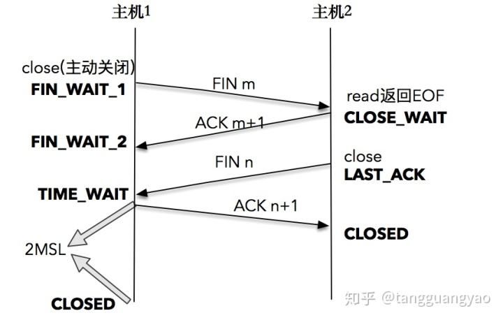
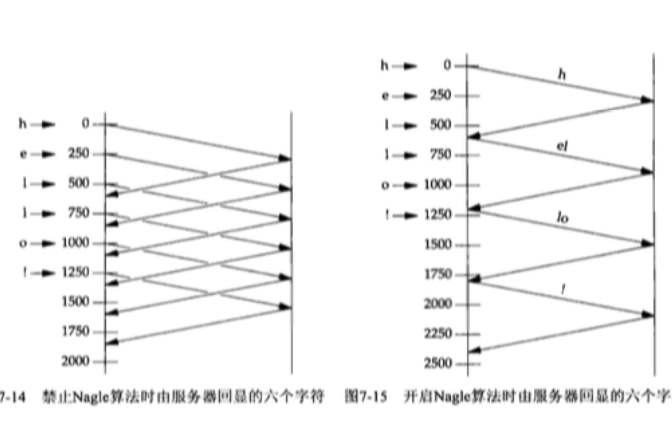

# TCP/IP网络编程

## 套接字Socket

套接字是一种通信机制，凭借这种机制，客户/服务器系统的开发工作既可以在本地单机上进行，也可以跨网络进行，Linux所提供的功能（如打印服务，ftp等）通常都是通过套接字来进行通信的。

## 套接字编程

网络编程创建连接请求的套接字过程：

1. 调用socket函数创建套接字

   > #include <sys/socket.h>
   >
   > int socket(int domain, int type, int protocol);
   >
   > domain-协议族               一般为PF_INET，代表IPv4互联网协议族
   >
   >  type-数据传输方式        SOCK_STREAM代表面向连接的套接字，对应TCP   
   >
   > ​					 SOCK_DGRAM代表面向消息的套接字，对应UDP
   >
   >  protocol-通信协议		一般设为0，表示选择当前family和type组合下的protocol
   >
   >  
   >
   > 成功返回文件描述符，失败时返回1

2. 调用bind函数分配IP地址和端口号

   > int bind(int sockfd,  sockaddr* myaddr, socklen_t addrlen);
   >
   > sockfd-套接字文件描述符
   >
   > myaddr-指向特定协议的地址结构的指针
   >
   > addrlen-该地址结构的长度
   >
   > 
   >
   > 成功返回0，失败返回-1

3. 调用listen函数转为可接收请求状态

   > int listen(int sockfd, int backlog);
   >
   > sockfd-套接字文件描述符
   >
   > backlog-连接请求等待队列的长度
   >
   >  
   >
   > 成功时返回0，失败时返回-1

 

4. 调用accept函数受理连接请求

   >  int accept(int sockfd,  sockaddr* addr,  socklent_t* addrlen);
   >
   > sockfd-套接字文件描述符
   >
   > addr-指向客户端地址结构体的指针
   >
   > addrlen-addr结构体的长度
   >
   >  
   >
   > 成功返回**创建的套接字文件描述符**，失败时返回-1

   

   

客户端创建套接字后调用connect函数

> int connect(int fd, sockaddr* serv_addr, socklen_t addrlen)

## 参数说明

- SOCK_STREAM：面向连接的套接字(TCP)

  - 传输过程数据不会丢失
  - 按序传输数据
  - 传输的数据**不存在数据边界**

  　收发的套接字内部有缓存，简言之就是字节数组。通过套接字传输的数据将保存到该数组，收到数据不意味着马上调用read函数。只要不超过数组容量，有可能在数据填充后一次read调用全部，也可能分多次进行调用，即传输的数据不存在数据边界

  　　

- sockaddr_in结构体成员变量

  - sin_family    地址族
  - sin_port        TCP/UDP端口号
  - sin_addr        IP地址
  - sin_zero         不使用

  　实际bind函数第二个参数期望得到的是sockaddr结构体变量地址值，但对于包含地址信息来讲非常麻烦，所以有了sockaddr_in结构体，生成符合bind函数要求的字节流，最后转换成sockaddr型的结构体传递给bind函数

  　　

- 字节序：CPU向内存保存数据的方式有２种，意味着CPU解析数据的方式也分为２种

  - 大端序(Big Endian)：高位字节存放到低位地址
  - 小端序(Little Endian)：高位字节放到高位地址

  代表CPU数据保存方式的主机字节序(Host Byte Order)在不同CPU中各不相同，目前主流的Intel系列CPU以小端序保存数据。因此在网络传输数据时约定统一方式，这种约定称为网络字节序(Network Byte Order)－统一为大端序

  htons函数中h代表主机(host)字节序，n代表网络(network)字节序，s指的是short.即可以解释为"将short型数据从主机字节序转化为网络字节序"

  通常以s作为后缀的函数中，s代表２个字节short，因此常用于端口号转换；以l结尾的函数中，l代表4个字节long，因此用于IP地址转换

  ​     

- 网络地址初始化

  memset(&addr, 0, sizeof(addr));                        //结构体变量addr的所有成员初始化为0

  addr.sin_family = AF_INET;                                  //指定地址族

  

  addr.sin_addr.s_addr = inet_addr(serv_ip);       //基于字符串的IP地址初始化(硬编码)

  addr.sin_addr.s_addr = htonl(INADDR_ANY);     //基于字符串的IP地址初始化(软编码)

  

  addr.sin_port = htons(atoi(serv_port));               //基于字符串的端口号初始化

  利用常数INADDR_ANY可以自动获取运行服务器端的计算机IP地址。

  127.0.0.1是回送地址(loopback address)，指的是计算机自身IP地址

## 缓冲区以及阻塞模式

1. 缓冲区概念

		每个socket被创建后，都会分配两个缓冲区，输入缓冲区和输出缓冲区。(全双工)

		**write()/send() 并不立即向网络中传输数据，而是先将数据写入缓冲区中，再由TCP协议将数据从缓冲区发送到目标机器**。一旦将数据写入到缓冲区，函数就可以成功返回，不管它们有没有到达目标机器，也不管它们何时被发送到网络，这些都是TCP协议负责的事情。
		
		**read()/recv() 函数也是如此，也从输入缓冲区中读取数据，而不是直接从网络中读取**。

- I/O缓冲区在每个TCP套接字中单独存在；
- I/O缓冲区在创建套接字时自动生成；
- 即使关闭套接字也会继续传送输出缓冲区中遗留的数据；
- 关闭套接字将丢失输入缓冲区中的数据。

​        

不会发生超过输入缓冲大小的数据传输，因为TCP会控制数据流

2. 使用write()/send()发送数据

   阻塞模式下：

   - 首先会检查缓冲区，**如果缓冲区的可用空间长度小于要发送的数据，那么 write()/send() 会被阻塞（暂停执行）**，直到缓冲区中的数据被发送到目标机器，腾出足够的空间，才唤醒 write()/send() 函数继续写入数据；
   - 如果TCP协议正在向网络发送数据，那么输出缓冲区会被锁定，不允许写入，write()/send() 也会被阻塞，直到数据发送完毕缓冲区解锁，write()/send() 才会被唤醒；
   - 如果要写入的数据大于缓冲区的最大长度，那么将分批写入，直到所有数据被写入缓冲区 write()/send() 才能返回；
   - send()函数默认情况下会使用Nagle算法。**Nagle算法通过将未确认的数据存入缓冲区直到积攒到一定数量一起发送的方法，来降低主机发送零碎小数据包的数目**。所以假设send()函数发送数据过快的话，该算法会将一些数据打包后统一发出去。通过setsockopt()的**TCP_NODELAY**选项来禁用Nagle算法。

   非阻塞模式下：

   - send()函数的过程仅仅是将数据拷贝到协议栈的缓冲区而已，如果缓冲区可用空间不够，则尽可能拷贝，返回成功拷贝的大小；如果缓存区可用空间为0，则返回-1，同时设置errno为EAGAIN。

   ​               

3. 使用read()/recv()读取数据

   阻塞模式下：

   - 首先会检查缓冲区，**如果缓冲区中有数据，那么就读取，否则函数会被阻塞，直到网络上有数据到来**；
   - 如果要读取的数据长度小于缓冲区中的数据长度，那么就**不能一次性将缓冲区中的所有数据读出，剩余数据将不断积压**，直到读取到数据后 read()/recv() 函数才会返回，否则就一直被阻塞。

   非阻塞模式下：

   - 接收数据时perror时常遇到**“Resource temporarilyunavailable”**的提示，errno代码为11(EAGAIN)。这表明你**在非阻塞模式下调用了阻塞操作**，在该操作没有完成就返回这个错误，这个错误不会破坏socket的同步，继续循环接着recv就可以。

​    

​     	 

## TCP套接字发送数据过程

1. 数据首先由应用程序缓冲区复制到发送端的输出缓冲区（位于内核），这个过程是用类似write功能的函数完成的。**有的人通常看到write成功就以为数据发送到了对端主机，其实这是错误的，write成功仅仅表示数据成功的由应用进程缓冲区复制到了输出缓冲区**。
2. **然后内核协议栈将输出缓冲区中的数据发送到对端主机，注意这个过程不受应用程序控制，而是发送端内核协议栈完成，其中包括使用滑动窗口、拥塞控制等功能**。
3. 数据到达接收端主机的输入缓冲区，注意这个接收过程也不受应用程序控制，而是**由接收端内核协议栈完成，其中包括发送ack确认等**。
4. **数据由套接字接收缓冲区复制到接收端应用程序缓冲区，这个过程是由类似read等函数来完成**。

## TCP套接字建立连接

三次握手：

- 第一次：客户端发送请求到服务器，服务器知道客户端发送，自己接收正常。SYN=1,seq=x
- 第二次：服务器发给客户端，客户端知道自己发送、接收正常，服务器接收、发送正常。ACK=1,ack=x+1,SYN=1,seq=y
- 第三次：客户端发给服务器：服务器知道客户端发送，接收正常，自己接收，发送也正常.seq=x+1,ACK=1,ack=y+1

## TCP套接字断开链接

四次挥手：

- 第一次：客户端请求断开FIN,seq=u
- 第二次：服务器确认客户端的断开请求ACK,ack=u+1,seq=v
- 第三次：服务器请求断开FIN,seq=w,ACK,ack=u+1
- 第四次：客户端确认服务器的断开ACK,ack=w+1,seq=u+1

## 优雅的断开连接

​		上图演示了两台正在进行双向通信的主机。主机A发送完数据后，单方面调用 close()/closesocket() 断开连接，之后主机A、B都不能再接受对方传输的数据。实际上，是完全无法调用与数据收发有关的函数，由主机B传输的，主机A接收的数据也就销毁了。这种生硬的方式显然不够“优雅”

​		为了解决这类问题，半关闭(Half-close)的方法应运而生。半关闭是指，可以传输数据但无法接收，或者可以接收数据但无法传输，即关闭流的一半。

​		实现方法是使用shutdown函数

> #include<sys/socket.h>
>
> int shutdown(int sock,  int howto);
>
> ​    
>
> 成功时返回0，失败返回-1
>
> - sock :需要断开的套接字文件描述符
> - howto：断开连接的方式  

​       

howto 在 Linux 下有以下取值：

- SHUT_RD：断开输入流。套接字无法接收数据（即使输入缓冲区收到数据也被抹去），无法调用输入相关函数。
- SHUT_WR：断开输出流。套接字无法发送数据，但如果输出缓冲区中还有未传输的数据，则将传递到目标主机。
- SHUT_RDWR：同时断开 I/O 流。相当于分两次调用 shutdown()，其中一次以 SHUT_RD 为参数，另一次以 SHUT_WR 为参数。

## time-wait状态

​		套接字经过4次挥手后并非立即消除，而是要经过一段时间Time-wait状态，只有先断开连接的（先发送FIN消息的）主机才经过Time-wait状态。此时，若服务器先断开连接，则无法立即重新运行，套接字处在Time-wait状态过程时，相应端口是正在使用的状态。而客户端套接字的端口是任意指定的，每次运行程序都会动态分配端口号，因此无需过多关注Time-wait状态。

- Time-wait存在理由：假设主机1向主机2发送最后的ack消息后立即消除套接字，但最后这条信息在传输过程中丢失，则主机2会认为自己之前发送的FIN消息未能到达主机1，继而试图重传。但此时主机1已经是关闭的状态，因此主机2永远无法收到主机1的消息。相反，若主机1的套接字处在Time-wait状态，则会向主机2重传最后的ACK消息。

## Nagle算法

​		TCP/IP协议中,无论发送多少数据,总是要在数据前面加上协议头,同时,对方接收到数据,也需要发送ACK表示确认.为了尽可能的利用网络带宽,TCP总是希望尽可能的发送足够大的数据.(在一个连接中会设置MSS参数,因此,TCP/IP希望每次都能够以MSS尺寸的数据块来发送数据).Nagle算法就是为了尽可能发送大块数据,避免网络中充斥着许多小数据块.

> 只有收到前一数据的ACK消息时，Nager算法才发送下一数据

TCP套接字默认使用Nager算法交换数据，因此最大限度进行缓冲，直到收到ACK,一般情况下，不使用Nagle算法可以提高传输速度，但如果无条件放弃使用，就会增多过多的网络流量

​		

# 多进程服务器端

## 并发服务器端的实现方法

网络程序中数据通信时间比CPU运算时间占比更大，因此向多个客户端提供服务是一种有效利用CPU的方式。下面是几种具有代表性的实现模型和方法：

- 多进程服务器：通过创建多个进程提供服务(Ｗindows不支持)
- 多路复用服务器：通过捆绑并统一管理I/O对象提供服务
- 多线程服务器：通过生成与客户端等量的线程提供服务

## 进程

- 进程(process)：占用内存空间的正在运行的程序

  ​		

- 进程ID：无论进程是如何创建的，所有进程都会从操作系统分配到ID（即PID)。其值为大于２的整数，１要分配给操作系统启动后的首个进程，因此用户无法得到ID值１

  > 通过指令ps可以查看当前运行的所有进程

  ​		

- CPU核的个数与进程数：拥有两个核的CPU称为双核(Dual)CPU，拥有４个核的CPU称为４核(Quad)CPU。**一个CPU中可能包含多个运算设备(核)，核的个数与可同时运行的进程数相同。相反，若进程数超过核数，进程将分时使用CPU资源（上下文切换）**。因为CPU运转速度极快，感觉上像是所有进程同时运行。

  ​	

- 调用fork()函数创建进程

  fork()函数将创建用的进程副本，并非根据完全不同的程序创建进程，而是复制正在进行的、调用fork函数的进程,调用fork函数后，父子进程拥有完全独立的内存结构。另外，两个进程都将执行fork函数调用后的语句。但因为通过同一个进程、复制相同的内存空间，之后的程序流要根据fork函数的返回值加以区分

  > #include <unistd.h>
  >
  > pid_t  fork(viod);
  >
  > 成功时返回进程ID，失败返回-1
  >
  > - 父进程：返回子进程ID
  > - 子进程：返回０

- 僵尸进程

  僵尸进程是当子进程比父进程先结束，而父进程又没有回收子进程，释放子进程占用的资源，此时子进程将成为一个僵尸进程。如果父进程先退出 ，子进程被init接管，子进程退出后init会回收其占用的相关资源

  

  向exit函数传递的参数值和return语句返回的值都会传递给操作系统，而操作系统不会销毁子进程，直到把这些值传递给产生该子进程的父进程，也就是说将子进程变成僵尸进程的正是操作系统。

  > 应该向创建子进程的父进程传递子进程的exit参数值或return语句的返回值

  操作系统不会主动把这些值传递给父进程，只有父进程主动发起请求（函数调用）时，操作系统才会传递该值。

[函数指针](../tools/git.md##版本控制)

