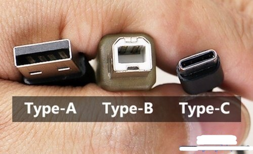

## USB接口与协议

type-a 和typ-c是物理接口类型， USB3.0和雷电是数据传输协议

​                                                                   接口类型

​																	 传输协议

传输速率gbps中的b代表bit，换算过后10gbps大约为1.2G/s

命名规则：3.1 gen1其实就是3.0的马甲

​		同理，3.2 gen1其实就是3.1 gen1

​					3.2 gen2其实就是3.1 gen2

​					3.2 gen2x2(这nt一般的命名) 速度能达到20gbps，只有type-c接口支持

